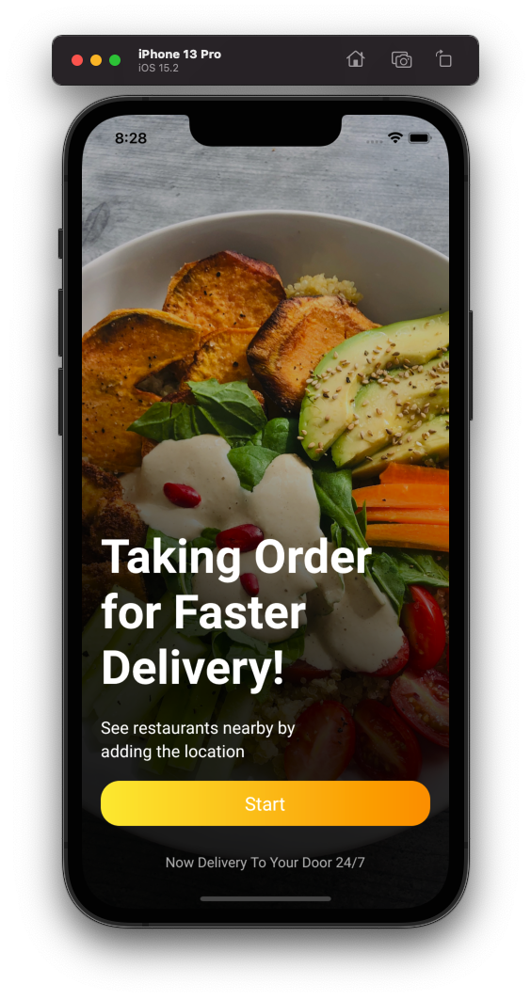
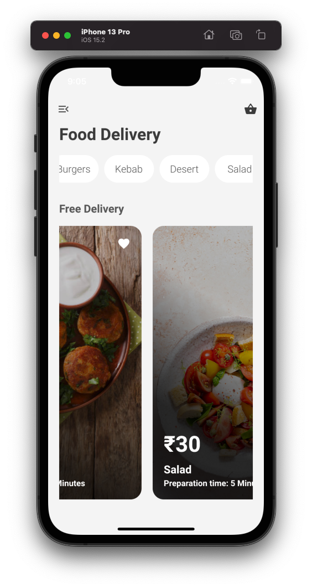
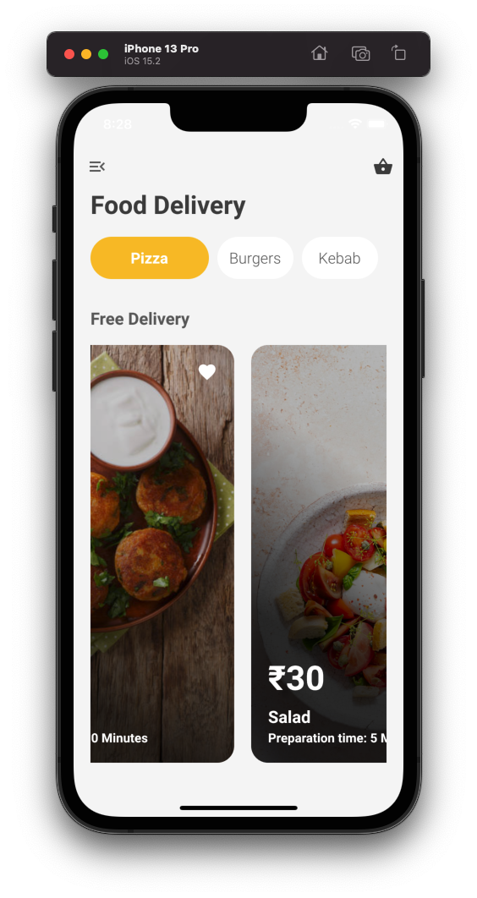

## Food App UI

This app is just the UI of a Food App

 ||  ||  

# Get Started

* Fork the the project
* Clone the repository to your local machine 
* Checkout the master branch 
* run command - 'flutter run'

# Developed by

Prabhneet Narula

# Get in touch

* [Twitter](https://twitter.com/PrabhneetNarula)

## Contribute

1. Check out the issues .
2. Comment 'want to work on this' to work on the particular issue and wait for the admin to assign you with the task.
3. Make required changes and commit (git commit -m 'Added some feature or fixed this issue').
4. Create new Pull Request

## Happy Fluttering 